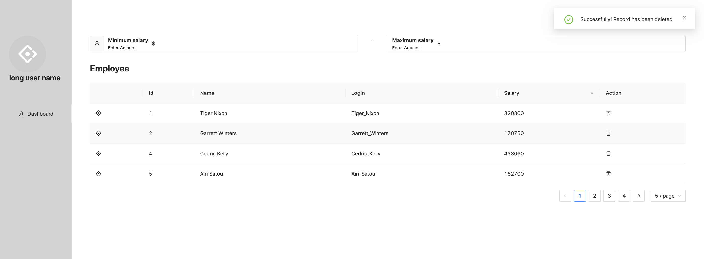
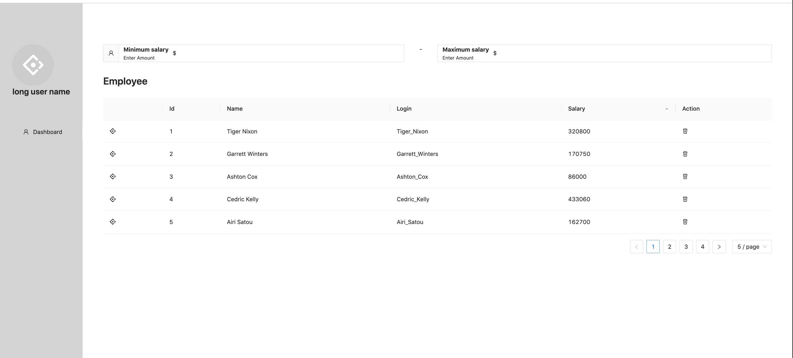
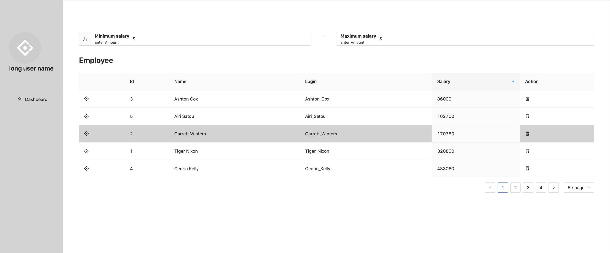
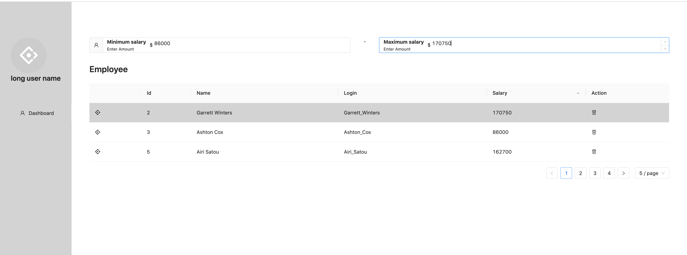
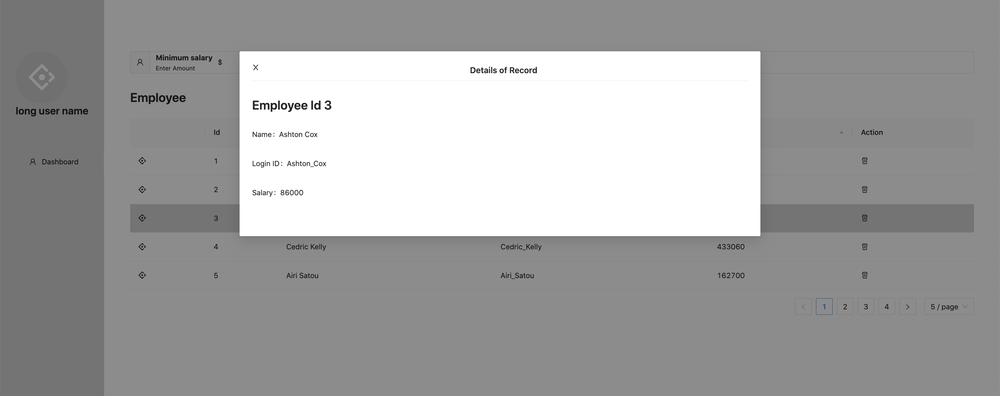

## Objectives

Created a simple employee dashboard.

<b>Overview</b>

 User is able to :
 - view and employee details at one go
 - filter employee based on salary range
 - sort the list by salary in ascending order
 - select a particular record, row will be highlighted in grey and a dialog box will render and display the details of the employee
 - user can delete record and a notification message will be shown at the side
 - handle pagination (5,10,15 per page)

 <b>Technology used</b>
 
React, React-Redux, Redux Toolkit, Ant Design, LESS, Dummy rest api example, fetch

## Run this project

<b> Step 1   : git clone/download this project</b>  
` git clone https://github.com/AbrialWong/NPHC.git ` 

<b> Step 2: Download the missing dependencies</b> 
`npm install or npm i`

<b> Step 3: Run the project </b> 
> a. Open a terminal and run `npm start`.

> b. Open a new terminal and run `ess-watch-compiler src/less src/css`, to compile the less file into css file at runtime

## Output

---
### Delete record
---

---
### Landing page
---

---
### Filter Table by salary in ascending order
---

---
### Sort by min and max salary
---

---
### Select particular record
---

## Authors

<a href="">Abrial Wong</a>

## Copyright

All images and details used in this project belongs to <a href="https://github.com/AbrialWong">Abrial Wong</a>. Do not mis-used it in any way or delete away this file. Thank you.

## Acknowledgments

 TODO: add in acknowlegement (if any)